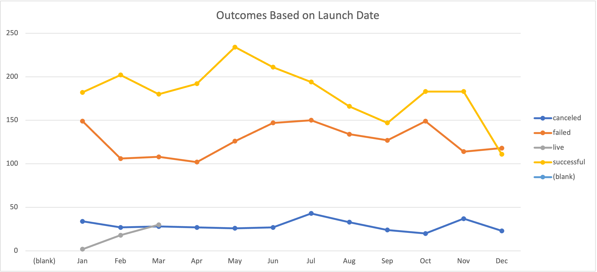
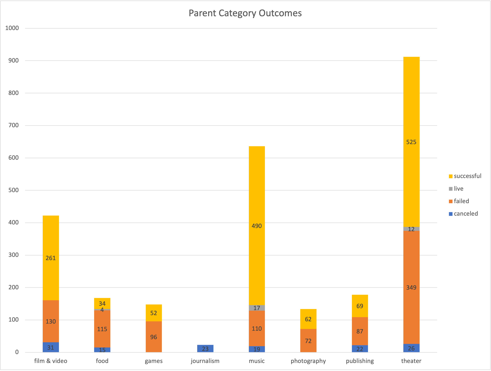
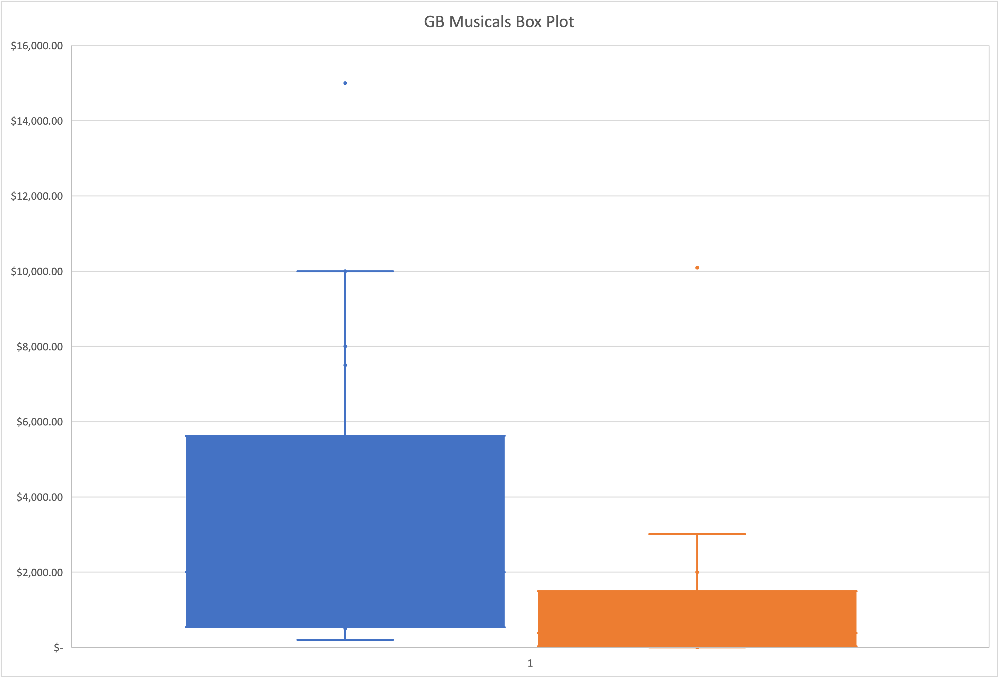

# An Analysis of Kickstarter Campaigns

Description: An analysis of kickstarter campaigns all over the world. 

## Results
The analysis showed that the launch date can have an impact on the success of the campaign. Late spring showed to be the best time and fall and winter were least successful. Successful campaigns also had reasonable fundraising goals. Theater, Music, and Film & Video had the most successful campaigns. Journalism had no success while Food, Games, Photography and Publishing had a modicum of success.  

- Kickstarter Spreadsheet 1
-- [Kickstarter_Spreadsheet_1](Kickstarter_Spreadsheet_1.xlsx.zip)
- Kickstarter Challenge Spreadsheet
-- [Kickstarter_Challenge](Kickstarter_Challenge.xlsx.zip)

## Visualizations

