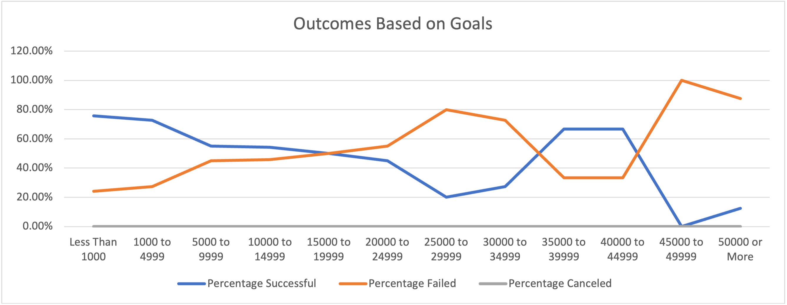

# Kickstarting with Excel

## Overview of Project

### Purpose
An analysis of kickstarter campaigns all over the world to help Louise understand how to be successful in a theater project.  

## Analysis and Challenges

- Kickstarter Spreadsheet 1
-- [Kickstarter_Spreadsheet_1](Kickstarter_Spreadsheet_1.xlsx.zip)
- Kickstarter Challenge Spreadsheet
-- [Kickstarter_Challenge](Kickstarter_Challenge.xlsx.zip)

### Visualization of Theater Outcomes 

### Analysis of Outcomes based on Launch Date

- Visualization of Outcomes based on Launch Date

- Visualization of Theater Outcomes Based on Launch Date

### Analysis of Outcomes Based on Goals

- Visualization of Outcomes of Plays Based on Goals

### Challenges and Difficulties Encountered

Some challenges/difficulties I encountered include having issues with the COUNTIFS function for the table on tab "Outcomes Based on Goals." I worked to check my work by creating a more simple COUNTIF table to have the totals on hand in order to understand whether I was achieving the right numbers. 

## Results

- Outcomes based on Launch Date
The data shows that launching in May is a good idea to have a successful campaign. Most failed campaigns started in the October, January, and in June. 

- Outcomes Based on Goals
Successful campaigns had lower goals then failed ones. 

- Limitations of this dataset
Some limitations of this dataset are that it does not account for different currencies and their conversion rates. It also does not provide analysis on the marketing strategy that has been employed for fundraising. 

- Other possible tables or graphs 
Other possible tables or graphs that could be created include box plots for other subcategory campaigns. Also bar graphs could be created that would tell more information about the Theater subcategories to help Louise visualize the successful campaigns. 

